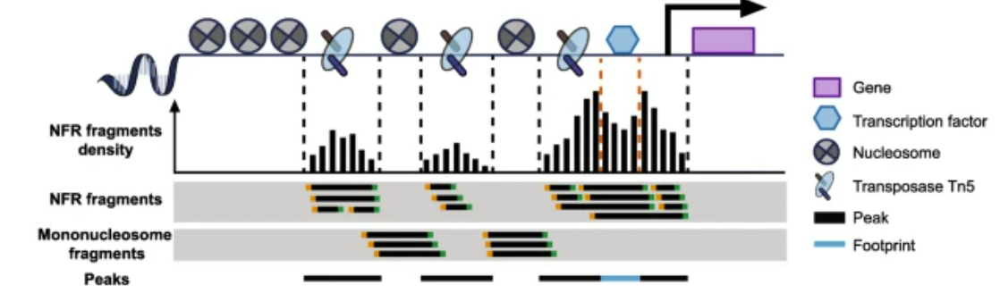
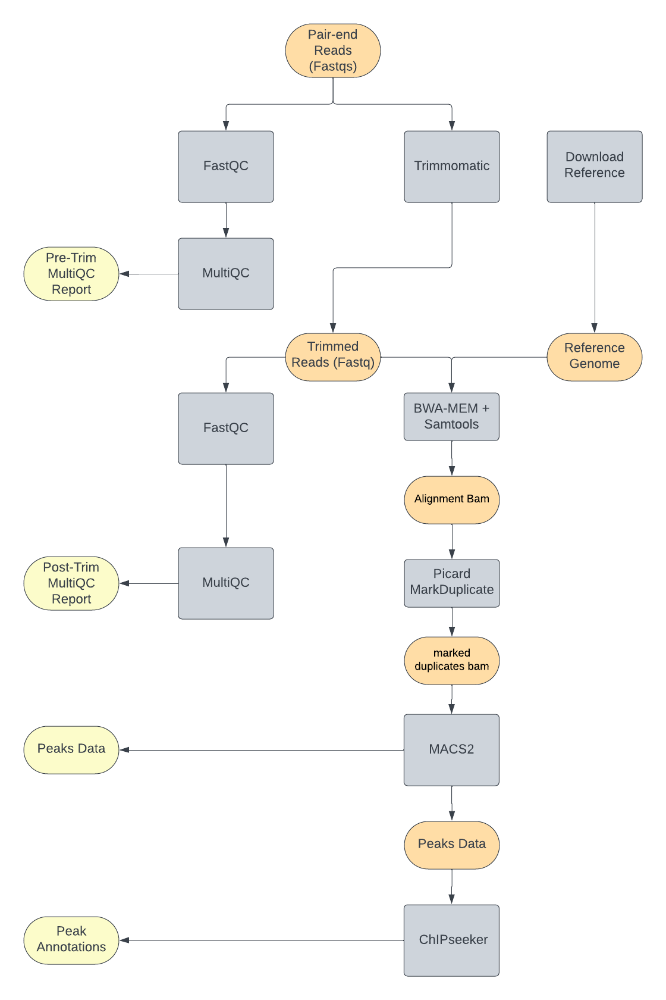
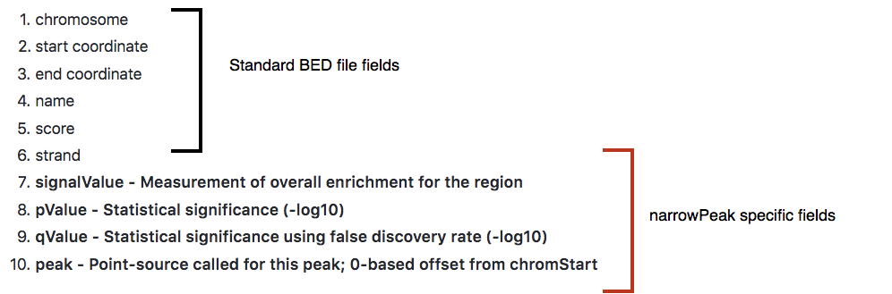
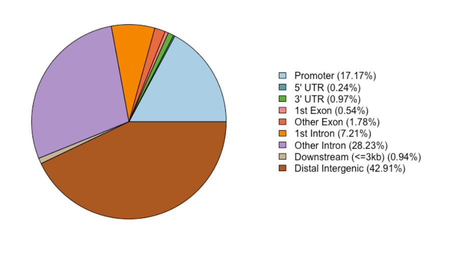
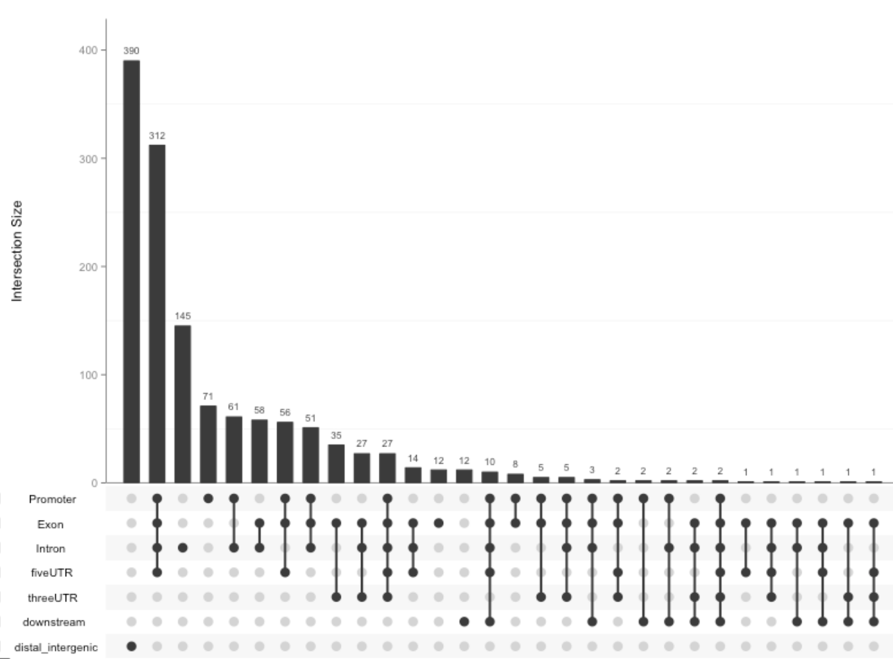

# BIOF501 Term Project: ATAC-seq Peak-calling and Annotation Pipeline

### *By Chun Hei (Jacky) Yiu*

------------------------------------------------------------------------

## Contents of this Repository:

### Directories

-   `Inputs` : Contains inputs for the pipeline, which are pair-end reads in FastQ format.

-   `script` : Contains the R scripts used in the pipeline for [ChIPseeker](https://bioconductor.org/packages/ChIPseeker/) peaks annotations.

### Files

-   `dag.png`: Graphical representation of the overall workflow in PNG format.

-   `nextflow.config`: Config file for Nextflow, contain all Docker container info and setting needed for using Singularity for this pipeline

-   `workflow.nf`: The main pipeline file that contain the instructions for running the pipeline through Nextflow.

------------------------------------------------------------------------

## Introduction

### Background

Recent gene regulation studies have focused on epigenetics, and through the advances of high-throughput sequencing technologies, various assays have been developed to decipher the epigenetic landscape, and one of the more wildly used method is Assay of Transposase Accessible Chromatin sequencing (ATAC-seq) [[1](#references)]. Ever since its debut in 2013, ATAC-seq data is used in a wide spectrum of biological questions [[2](#references)], such as depicting enhancer landscapes in healthy mammalian tissue and cell types [[3](#references)], studying accessibility changes between normal hematopoiesis and leukemia [[4](#references)], as well as the chromatin state within schizophrenia patients and the Cancer Genome Atlas (TCGA) pan-cancer cohort [[5](#references)].

Briefly, ATAC-seq incorporates a genetically engineered hyperactive Tn5 transposase that simultaneously cuts open chromatin leaving a 9-bp staggered nick and ligates high-throughput sequencing adapters to these regions. During this process, the nick is repaired, leaving a 9-bp duplication [[6](#references)]. Paired-end sequencing is then performed to facilitate higher unique alignment rates of these open regions.

The following figures show the schematic diagram of ATAC-seq:



### Purpose

My pipeline will cover the four most important steps in ATAC-seq data analysis in Human genome:

1.  Quality Control

2.  Alignment

3.  Post alignment Processing

4.  Core analysis (Peak Calling)

5.  Advanced peaks analysis (Peak Annotation)

These steps will allow researchers to conduct robust analysis on ATAC-seq data and generate more biological meaningful results.

### Rationale

Despite the simplicity and robustness of ATAC-seq, a major impediment exists as there are few bioinformatic analysis tools developed specifically for ATAC-seq data [[7](#0)]. Analysis tools used in ChIP-seq and DNase-seq (e.g. [MACS2](#0) [[8](#0)], [HOMER](#0) [[9](#0)], etc) have been applied to ATAC-seq assuming similar data characteristics [[10](#0)].

The major focus of this pipeline is to show case current resources for ATAC-seq analysis and develop a basic pipeline workflow that covers the major parts of ATAC-seq data analysis.

------------------------------------------------------------------------

## Usage

### Installation

Installing this pipeline requires `git` , `nextflow`, and `singularity`

Click [here](https://git-scm.com/book/en/v2/Getting-Started-Installing-Git) for instruction to install `git`

Click [here](https://www.nextflow.io/docs/latest/getstarted.html) for instruction to install `nextflow`

Click [here](https://docs.sylabs.io/guides/3.0/user-guide/installation.html) for instruction to install `singularity`

After installing all three, clone the repository by running the following command in a terminal:

```         
git clone https://github.com/Jacky-Yiu/ATAC-seq_Peak_Calling_Pipeline.git
```

The pipeline use the following container from [DockerHub](https://hub.docker.com/):

``` bash
staphb/fastqc:latest
ewels/multiqc:latest
staphb/fastqc:latest
ewels/multiqc:latest
staphb/trimmomatic:latest
niemasd/minimap2_samtools:latest
broadinstitute/picard:latest
dukegcb/macs2:latest
jackyyiu0810/chipseeker:v0.9
```

Nextflow will automatically download all the container and run the analysis inside them, so you do need to manually download them, just make sure `singularity` is properly installed and is in you PATH.

### Running the Pipeline

Th command above should download the pipeline in your local directory, enter the pipeline directory using the following command:

```         
cd ./ATAC-seq_Peak_Calling_Pipeline
```

The pipeline can then be run by typing in:

```         
nextflow run workflow.nf
```

It will take around 15 mins for the first run since Nextflow need to pull all the required container, but subsequent run should be a lot quicker (\~5-10mins) since the container is downloaded.

### Pipeline Overview

The following is a simplified representation of the workflow in a Directed Acyclic Graph (DAG):

{width="679"}

This pipeline will take in pair-end FastQ generated by ATAC-Seq and go through 5 phases

1.  Quality Control and Read Trimming:

    -   The pre-alignment QC steps are standard for most high-throughput sequencing technologies. In this pipline, FastQC and MultiQC [[11](#references)] are used to visualize base quality scores, GC content, sequence length distribution, sequence duplication levels, k-mer overrepresentation and contamination of primers and adapters in the sequencing data.

    -   Currently, due to the ubiquitous use of Illumina's Nextera library for ATAC-seq, over-representation of Nextera sequencing adapters is often observed and should be removed for accurate read alignment. We use Trimmomatic [[12](#references)] in this pipeline as it have a built-in adapter sequences for Nextera and TruSeq library. Low-quality bases can also be eliminated using these tools.

    -   After read trimming, FastQC and MultiQC can be performed again to check the successful removal of adapter and low-quality bases. Trimmed reads are then mapped to a reference genome.

2.  Alignment:

    -   We first download the hg19 reference for alignment.
    -   BWA-MEM aligner [[13](#references)] is used because it is memory-efficient and fast for short paired-end reads. The soft-clip strategy from BWA-MEM allows the overhang of bases on both ends of reads which can further increase unique mapping rates.

3.  Post-alignment processing:

    -   After sequence alignment, as in most DNA sequencing data, basic metrics of the aligned BAM file, such as unique mapping reads/rates, duplicated read percentages, and fragment size distribution can be collected using Picard [[14](#references)] and SAMtools [[15](#references)].

4.  Peak Calling:

    -   The second major step of ATAC-seq data analysis is to identify accessible regions (also referred to as peaks) and is the basis for advanced analysis. MACS2 is is used here as it the default peak caller of most ATAC-seq pipeline, it is actively being maintained and consume less computational resource than other tools such as HMMRATAC [[16](#references)].

5.  Peak Annotation:

    -   After obtaining peak sets, annotation of peaks is done to associate chromatin accessibility with gene regulation. Normally, peaks are annotated by the nearest genes or regulatory elements. ChIPseeker [[17](#references)] is used here as it is widely used to assign peaks to nearest or overlapping gene, exon, intron, promoter, 5′ untranslated region (UTR), 3′ UTR, and other genomic features.ChIPseeker also have abundant visualization functions for interpreting annotation results, such as a pie chart of annotated genomic features.

### Data Used

For this pipeline, an example human genome ATAC-seq data is used, it came from a study in 2023 that study Chromatin compaction [[18](#references)]. The SRA accession of the dataset is [SRR26784755](https://www.ncbi.nlm.nih.gov/sra/?term=SRR26784755). The experiment want to see how the over-expression of E3 ubiquitin ligase TRIP12 induces the formation of chromatin condensates and interferes with DNA damage response. They generated the data using ATAC-seq on transfected Hela S3 cells and sequence using Illumina sequencing (NextSeq 500).

Since the pipeline is only aim for covering the general peak analysis of ATAC-seq, the background of the data is not of particular interest to me, I only need an example ATAC-seq dats on human genome.

The original data is more than 2GB, I used the following command to sample the original fastq and produce two example sample pair-end reads that is used in the pipeline.

``` bash
seqtk sample -s100 SRR26784755_2.fastq.gz 100000 > genome_a2.fq
seqtk sample -s100 SRR26784755_1.fastq.gz 100000 > genome_a1.fq

seqtk sample -s654 SRR26784755_2.fastq.gz 100000 > genome_b2.fq
seqtk sample -s654 SRR26784755_1.fastq.gz 100000 > genome_b1.fq

gzip genome_*.fq
```

Basically, `seqtk sample` randomly sample (seed = 100, 654) 100000 reads from the original fastq to create 2 smaller sample. The pipeline is designe to take in multiple fastq in the input file as long as the have the following naming convention:

-   `{sample_name}1.fq.gz`

-   `{sample_name}2.fq.gz`

For reference, hg38 is used as it is the most popular option. it is automatically downloaded when you run the pipeline, it is downloaded from the UCSC human genome database:

<https://hgdownload.cse.ucsc.edu/goldenpath/hg38/bigZips/hg38.fa.gz>

------------------------------------------------------------------------

## Outputs

The four outputs of this pipeline are as follows:

1.  Pre-trim MultiQC Report

    -   A HTML file that visualize base quality scores, GC content, sequence length distribution, sequence duplication levels, k-mer overrepresentation and contamination of primers and adapters in the pre-trimmed pair-end fastq.

2.  Post-trim MultiQC Report

    -   A HTML file that visualize base quality scores, GC content, sequence length distribution, sequence duplication levels, k-mer overrepresentation and contamination of primers and adapters in the trimmed pair-end fastq.

3.  Peaks File

    -   ``` MACS2_output/{Sample_ID}/``{Sample_ID}``_peaks.narrowPeak ```

        -   A narrowPeak (.narrowPeak) file is used by the ENCODE project to provide called peaks of signal enrichment based on pooled, normalized (interpreted) data. It is a BED 6+4 format, which means the first 6 columns of a standard BED file with **4 additional fields**:

            {width="800"}

    -   `MACS2_output/{Sample_ID}/{Sample_ID}_peaks.xls`

        -   a tabular file which contains information about called peaks. Additional information includes pileup and fold enrichment

    -   `MACS2_output/{Sample_ID}/{Sample_ID}_summits.bed` :

        -   peak summits locations for every peak. 

4.  Peak Annotation Plot

    -   `peak_plot.pdf` : Contain 2 plots:

        -   Pie chart of genomic region annotation:

            {width="426"}

        -   Upset Plot of genomic region annotation:

            {width="554"}

------------------------------------------------------------------------

## References {#references}

[1] Buenrostro, Jason D., Beijing Wu, Howard Y. Chang, and William J. Greenleaf. 2015. "ATAC-seq: A Method for Assaying Chromatin Accessibility Genome-Wide." *Current Protocols in Molecular Biology* 109 (January): 21.29.1--9. <https://doi.org/10.1002/0471142727.mb2129s109>.

[2] Yan, Feng, David R. Powell, David J. Curtis, and Nicholas C. Wong. 2020. "From Reads to Insight: A Hitchhiker's Guide to ATAC-Seq Data Analysis." *Genome Biology* 21 (1): 22. <https://doi.org/10.1186/s13059-020-1929-3>.

[3] Cusanovich, Darren A., Andrew J. Hill, Delasa Aghamirzaie, Riza M. Daza, Hannah A. Pliner, Joel B. Berletch, Galina N. Filippova, et al. 2018. "A Single-Cell Atlas of in Vivo Mammalian Chromatin Accessibility." *Cell* 174 (5): 1309--1324.e18. <https://doi.org/10.1016/j.cell.2018.06.052>.

[4] Corces, M. Ryan, Jason D. Buenrostro, Beijing Wu, Peyton G. Greenside, Steven M. Chan, Julie L. Koenig, Michael P. Snyder, et al. 2016. "Lineage-Specific and Single-Cell Chromatin Accessibility Charts Human Hematopoiesis and Leukemia Evolution." *Nature Genetics* 48 (10): 1193--203. <https://doi.org/10.1038/ng.3646>.

[5] Bryois, Julien, Melanie E. Garrett, Lingyun Song, Alexias Safi, Paola Giusti-Rodriguez, Graham D. Johnson, Annie W. Shieh, et al. 2018. "Evaluation of Chromatin Accessibility in Prefrontal Cortex of Individuals with Schizophrenia." *Nature Communications* 9 (1): 3121. <https://doi.org/10.1038/s41467-018-05379-y>.

[6] Buenrostro, Jason D., Paul G. Giresi, Lisa C. Zaba, Howard Y. Chang, and William J. Greenleaf. 2013. "Transposition of Native Chromatin for Fast and Sensitive Epigenomic Profiling of Open Chromatin, DNA-Binding Proteins and Nucleosome Position." *Nature Methods* 10 (12): 1213--18. <https://doi.org/10.1038/nmeth.2688>.

[7] Angarica, Vladimir Espinosa, and Antonio del Sol. 2017. "Bioinformatics Tools for Genome-Wide Epigenetic Research." In, edited by Raul Delgado-Morales, 489--512. Advances in Experimental Medicine and Biology. Cham: Springer International Publishing. <https://doi.org/10.1007/978-3-319-53889-1_25>.

[8] Zhang, Yong, Tao Liu, Clifford A. Meyer, Jérôme Eeckhoute, David S. Johnson, Bradley E. Bernstein, Chad Nusbaum, et al. 2008. "Model-Based Analysis of ChIP-Seq (MACS)." *Genome Biology* 9 (9): R137. <https://doi.org/10.1186/gb-2008-9-9-r137>.

[9] Heinz, Sven, Christopher Benner, Nathanael Spann, Eric Bertolino, Yin C. Lin, Peter Laslo, Jason X. Cheng, Cornelis Murre, Harinder Singh, and Christopher K. Glass. 2010. "Simple combinations of lineage-determining transcription factors prime cis-regulatory elements required for macrophage and B cell identities." *Molecular Cell* 38 (4): 576--89. <https://doi.org/10.1016/j.molcel.2010.05.004>.

[10] Chang, Pearl, Moloya Gohain, Ming-Ren Yen, and Pao-Yang Chen. 2018. "Computational Methods for Assessing Chromatin Hierarchy." *Computational and Structural Biotechnology Journal* 16 (January): 43--53. <https://doi.org/10.1016/j.csbj.2018.02.003>.

[11] Ewels, Philip, Måns Magnusson, Sverker Lundin, and Max Käller. 2016. "MultiQC: Summarize Analysis Results for Multiple Tools and Samples in a Single Report." *Bioinformatics* 32 (19): 3047--48. <https://doi.org/10.1093/bioinformatics/btw354>.

[12] Bolger, Anthony M., Marc Lohse, and Bjoern Usadel. 2014. "Trimmomatic: A Flexible Trimmer for Illumina Sequence Data." *Bioinformatics* 30 (15): 2114--20. <https://doi.org/10.1093/bioinformatics/btu170>.

[13] Li, Heng, and Richard Durbin. 2009. "Fast and Accurate Short Read Alignment with Burrowswheeler Transform." *Bioinformatics* 25 (14): 1754--60. <https://doi.org/10.1093/bioinformatics/btp324>.

[14] "Picard Tools - by Broad Institute." n.d. <https://broadinstitute.github.io/picard/>.

[15] Li, Heng, Bob Handsaker, Alec Wysoker, Tim Fennell, Jue Ruan, Nils Homer, Gabor Marth, Goncalo Abecasis, Richard Durbin, and 1000 Genome Project Data Processing Subgroup. 2009. "The Sequence Alignment/Map Format and SAMtools." *Bioinformatics* 25 (16): 2078--79. <https://doi.org/10.1093/bioinformatics/btp352>.

[16] Tarbell, Evan D., and Tao Liu. 2019. "HMMRATAC: a Hidden Markov ModeleR for ATAC-seq." *Nucleic Acids Research* 47 (16): e91. <https://doi.org/10.1093/nar/gkz533>.

[17] Yu, Guangchuang, Li-Gen Wang, and Qing-Yu He. 2015a. "ChIPseeker: An r/Bioconductor Package for ChIP Peak Annotation, Comparison and Visualization." *Bioinformatics* 31 (14): 2382--83. <https://doi.org/10.1093/bioinformatics/btv145>.

[18] Vargas, Claire, Manon Brunet, Alban Ricard, Damien Varry, Dorian Larrieu, Fernando Muzzopappa, Fabian Erdel, et al. n.d. "The Intrinsically Disordered Region of the E3 Ubiquitin Ligase TRIP12 Induces the Formation of Chromatin Condensates and Interferes with DNA Damage Response." <https://doi.org/10.1101/2023.09.13.556486>.
